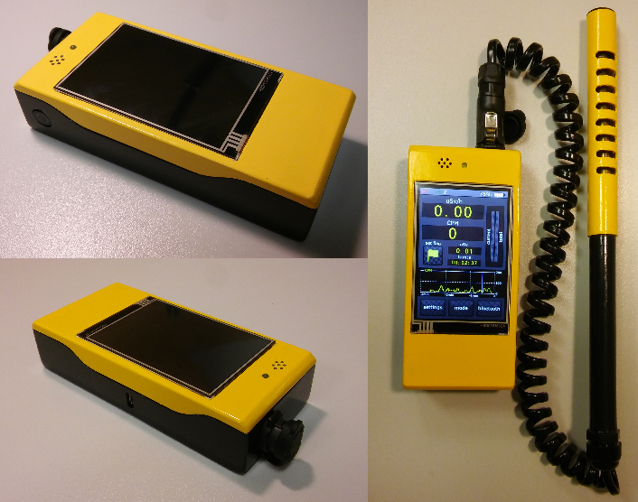
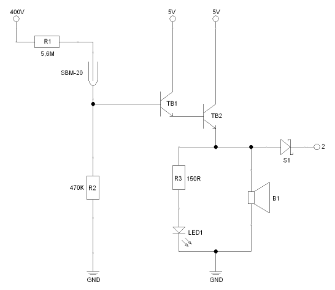

# Geiger-Muller counter

This project describes complete process of designing and constructing
Geiger-Muller counter device.

## Counter final form:

## Features:
- Current radiation measurement
- Background radiation measurement
- Total absorbed radiation dose measurement
- High radiation levels warnings
- 3.5" touch screen
- Advanced data presentation
- Dedicated android application for storing measured data
- Bluetooth connection
- 3D printed cover
- Measurements modes
- LED and buzzer notifications
- Li-ion cell

## Scientific background
A Geiger–Müller counter is device used for detecting and measuring ionizing radiation.
It detects radiation such as alpha particles, beta particles, and gamma rays.
Detection is possible thanks to ionization effect produced in a Geiger–Müller tube.

Between anode (_A_) and cathode (_K_) there is high voltage applied (typically 400–900V),
which enables tube operation. Tube is filled with an inert gas such as helium, neon,
or argon at low pressure. When a particle or photon of incident radiation goes through the tube,
it makes the gas conductive by ionization and the tube briefly conducts electrical charge.
The ionization is considerably amplified within the tube by the Townsend discharge effect to
produce an easily measured detection pulse. Pulses are counted by electronic device and
recalculated to radiation in Sv/Rem, according to tube characteristic.

## Data presented on Counter screen:

1. Bluetooth connection status
2. Touch screen status
3. Background radiation subtraction status
4. Screen brightness
5. Battery level
6. Radiation level (uSv/h, uRem/h)
7. Counts per minute (CPM)
8. Total dose absorbed (uSv, uRem)
9. Measurement time
10. Radiation level warning bars
11. CPM chart from last 3 minutes
12. Adjustable CPM chart range
13. Button for adding markers to measurement
14. Button opening settings submenu
15. Button opening measurement modes submenu
16. Button opening bluetooth connection submenu

## Electronics

### _Geiger-Muller tube amplification_
The most crucial circuit of whole device is detection and amplification of
Geiger-Muller tube pulses. Detection is performed by tube SBM-20.
Between its anode and cathode there is high 400V voltage applied.
Pulses amplification is done by two bipolar transistors BC547B.
Output signal is connected to uC input pin with interrupts handling implemented.
Additionally, every pulse is notified by LED and buzzer connected to the circuit.

### _Power supply_
Device is powered by Li-ion cell Panasonic NCR 18650B if capacity 3400mAh.
For charging and cell protection it is used circuit TP4056.
To ensure stable voltage for the device there is also DC-DC converter
used which generates output voltage 5V regardless battery voltage.
As mentioned already, Geiger-Muller tube requires 400V for proper operation.
For this reason there is another DC-DC transformer used which accepts 5V
as input and generates 400V output.

There are other electronic elements and circuits integrated into device.
The full electrical diagram is available _[here](resources/electronics/ee_complete.png)_.

## Atmega software
Main Counter logic is written in C based Arduino language.
Used libraries:
- Arduino
- Nextion
- SoftwareSerial

Interrupts are used to detect Geiger-Muller tube pulses as well as button press.

In _loop()_ function there is periodic execution of:
- Radiation measurement and calculations
- Touch screen actions handling
- Power button actions handling
- Bluetooth connection and communication
- Battery voltage monitoring
- Warnings handling

Communication with touch screen is carried out via UART. Data to be displayed is sent periodically. Touch screen actions are obtained with use of polling mechanism. Every actions has its own unique id which triggers certain action in uC.

Complete Atmega source code is available _[here](Atmega/Atmega_328P.ino)_.

## Geiger RL2018PI application
This Android application was created in Android Studio/Java.

It's main task is to establish connection with Geiger-Muller counter via Bluetooth, collect measurement data
and generate output .xls file for later analysis.

1. Connection status
2. Data received from Geiger-Muller counter
3. Button to connect/disconnect 
4. List of paired bluetooth devices

## Device cover
_TODO_

## Counter characteristics
_TODO_

## Technologies
_TODO_

## License
[MIT](https://choosealicense.com/licenses/mit/)
