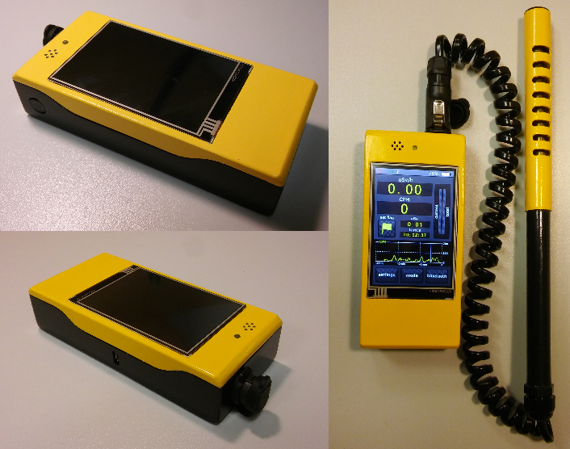
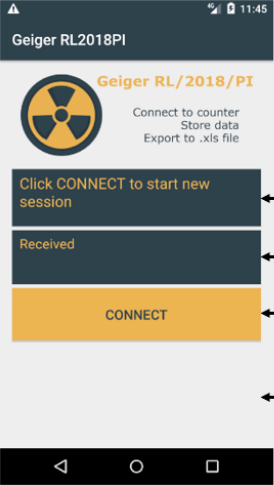

# Geiger-Muller counter

This project describes complete process of designing and constructing of
Geiger-Muller counter device.

Counter final form:

## Features:
- Radiation measurement in uSv or Rem
- 3.5" touch screen
- Dedicated android application for storing measured data
- Bluetooth connection
- 3D printed cover
- Measurements modes
- High radiation levels warnings
- LED and buzzer notifications
- Li-ion cell

## Scientific background
_TODO_

## Atmega software
_TODO_

## Android application
_TODO_

## Device cover
_TODO_

## Counter characteristics
_TODO_

## Technologies
_TODO_

## License
_TODO_
