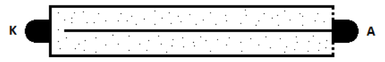

# Geiger-Muller counter

This project describes complete process of designing and constructing
Geiger-Muller counter device.

## Counter final form:

## Features:
- Current radiation measurement
- Background radiation measurement
- Total absorbed radiation dose measurement
- High radiation levels warnings
- 3.5" touch screen
- Advanced data presentation
- Dedicated android application for storing measured data
- Bluetooth connection
- 3D printed cover
- Measurements modes
- LED and buzzer notifications
- Li-ion cell

## Data presented on Counter screen:

1. Bluetooth connection status
2. Touch screen status
3. Background radiation subtraction status
4. Screen brightness
5. Battery level
6. Radiation level (uSv/h, uRem/h)
7. Counts per minute (CPM)
8. Total dose absorbed (uSv, uRem)
9. Measurement time
10. Radiation level warning bars
11. CPM chart from last 3 minutes
12. Adjustable CPM chart range
13. Button for adding markers to measurement
14. Button opening settings submenu
15. Button opening measurement modes submenu
16. Button opening bluetooth connection submenu

## Scientific background
A Geiger–Müller counter is device used for detecting and measuring ionizing radiation.
It detects radiation such as alpha particles, beta particles, and gamma rays.
Detection is possible thanks to ionization effect produced in a Geiger–Müller tube.

Between anode (_A_) and cathode (_K_) there is high voltage applied (typically 400–900V),
which enables tube operation. Tube is filled with an inert gas such as helium, neon,
or argon at low pressure. When a particle or photon of incident radiation goes through the tube,
it makes the gas conductive by ionization and the tube briefly conducts electrical charge.
The ionization is considerably amplified within the tube by the Townsend discharge effect to
produce an easily measured detection pulse. Pulses are counted by electronic device and
recalculated to radiation in Sv/Rem, according to tube characteristic.

## Electronics
_TODO_

## Atmega software
_TODO_

## Geiger RL2018PI application
This Android application was created in Android Studio/Java.

It's main task is to establish connection with Geiger-Muller counter via Bluetooth, collect measurement data
and generate output .xls file for later analysis.

1. Connection status
2. Data received from Geiger-Muller counter
3. Button to connect/disconnect 
4. List of paired bluetooth devices

## Device cover
_TODO_

## Counter characteristics
_TODO_

## Technologies
_TODO_

## License
[MIT](https://choosealicense.com/licenses/mit/)
